# EC2 Setup 💻
### Step 1: Log into your AWS account ➡️
- If you haven't already, go ahead and create an account for AWS
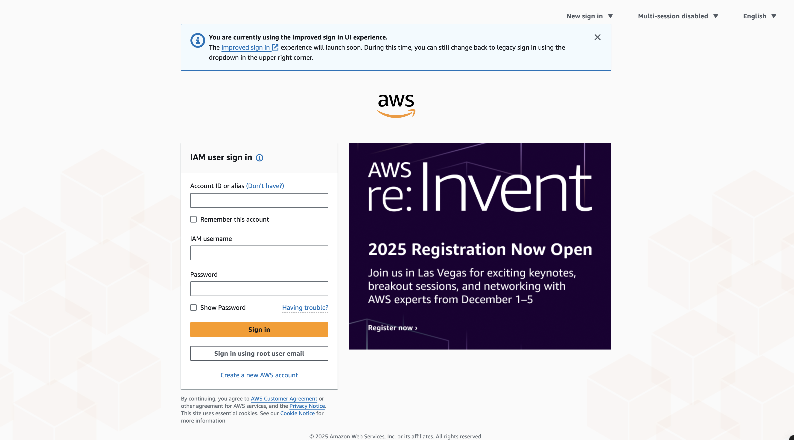

### Step 2: After configuring your AWS account, search up **EC2** in the search bar, or select it if you have used it before ➡️
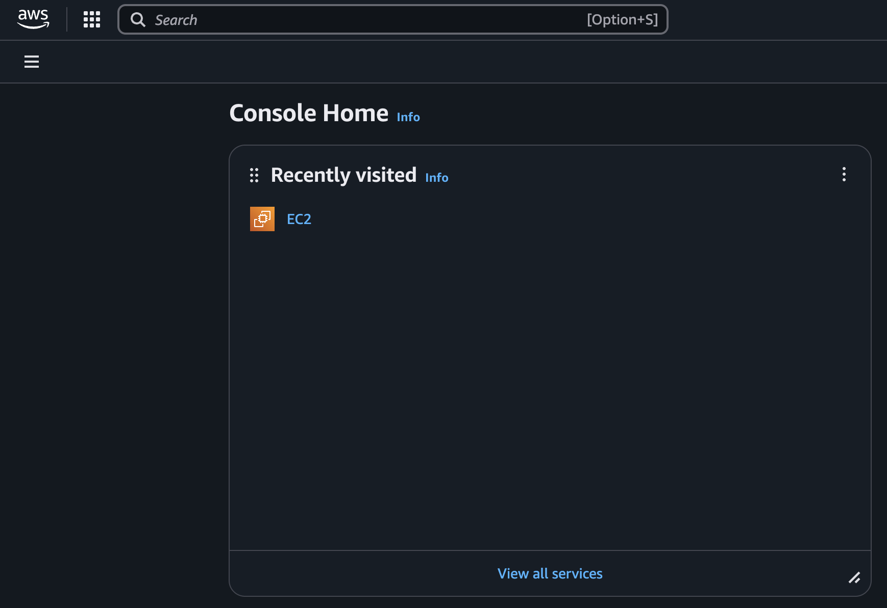

### Step 3: Launching the Instance
- After you select '**Launch Instance**'
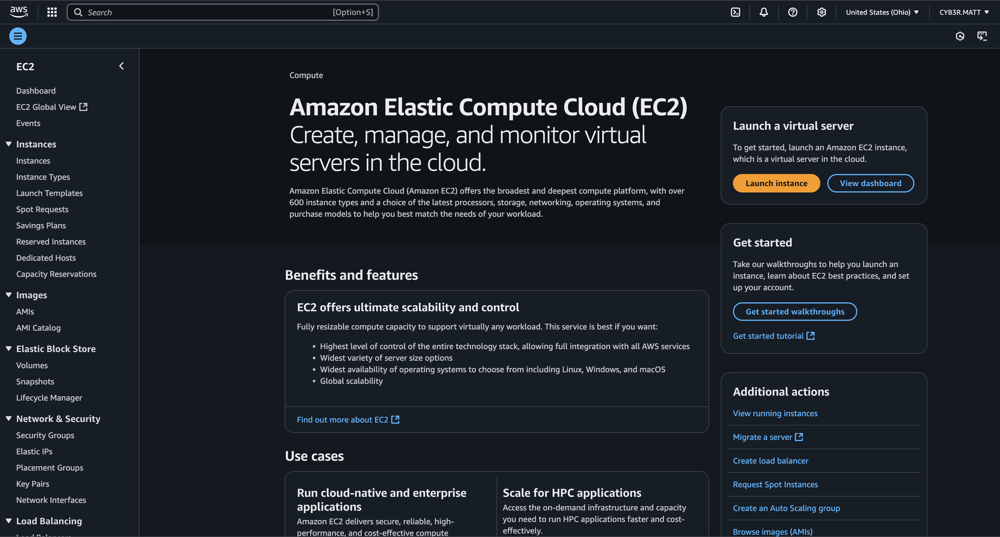
- You are going to name your instance (something sensible), and select **Windows** as your **AMI** 
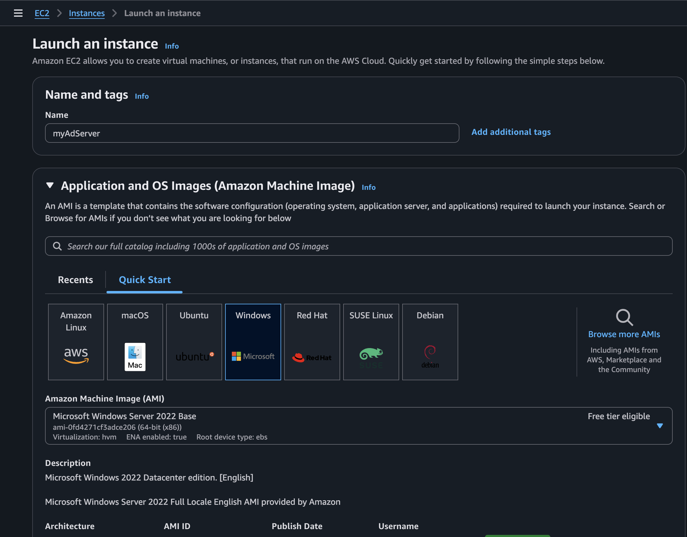
- For the '**Instance Type** the **t2.micro** is enough to get the lab done
- I already had a key pair created, so if you don't have one, go ahead and select '**create new key pair**' (don't forget to name it) and it will automatically download to your computer
- And although it's not impossible, for security purposes, under the **Networking** tab, change it from '**Anywhere**' to '**My IP**' to prevent unwanted guests from accessing your Instance
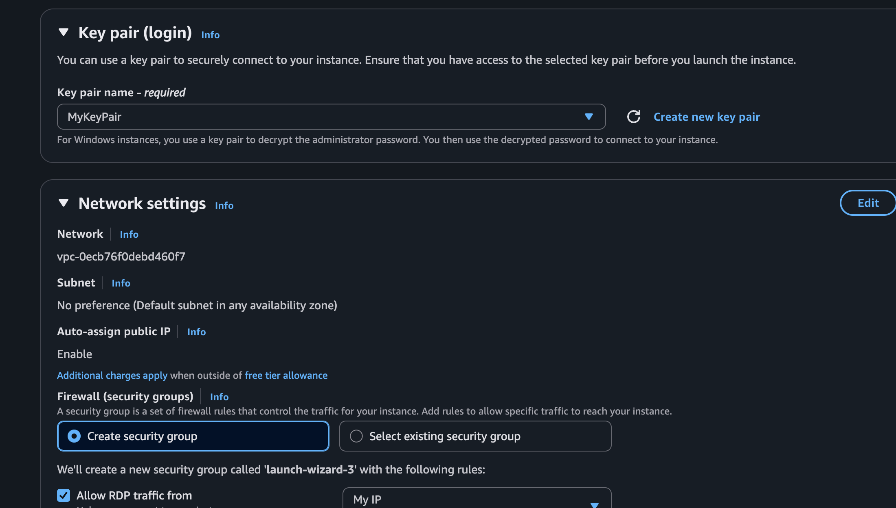
- **Congrats!** You've provisioned your first **EC2** instance on AWS to run and configure a Windows Server, now go ahead and hit launch
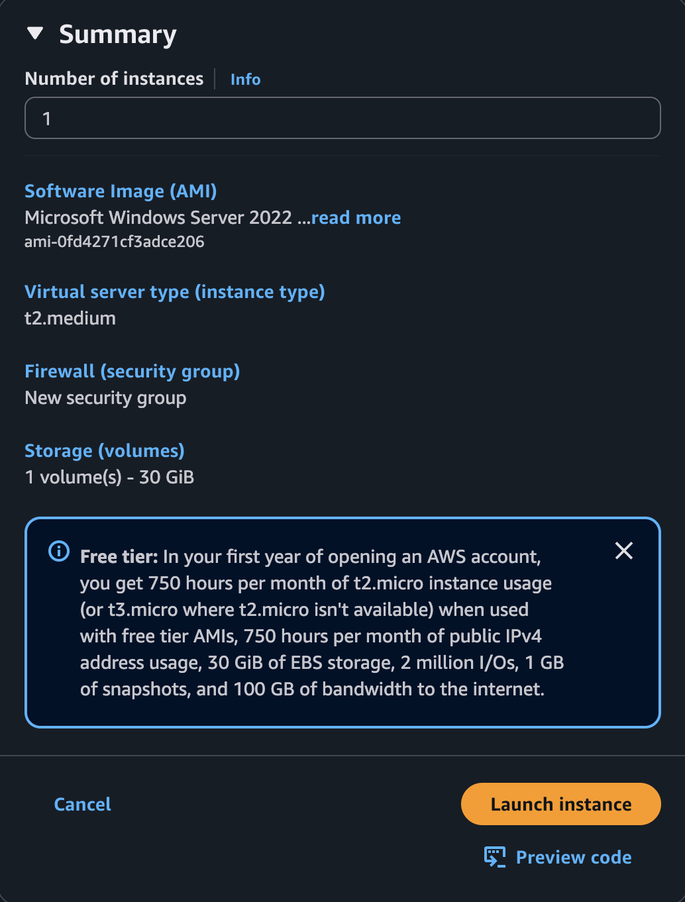
- After hitting launch, you'll be sent to another page, and at the top you are going to hit the underlined portion of the sentence in the **green** bubble
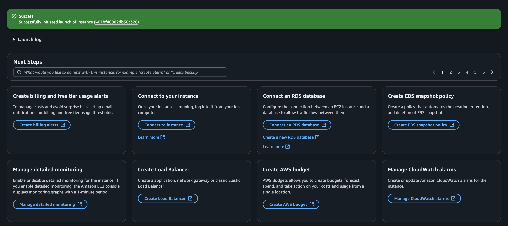
- After getting sent to the next page, select the **check box** for your newly provisioned instance, and click on **connect** towards the top of the page
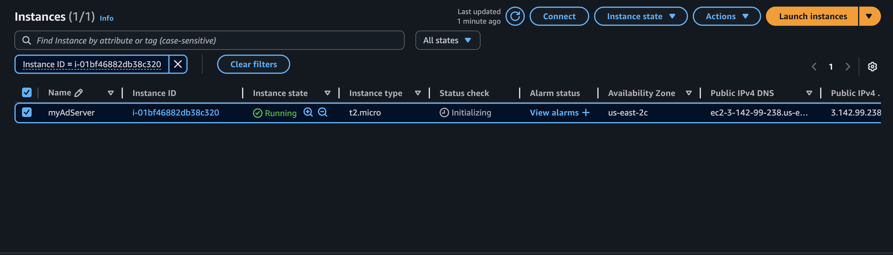
- Since we provisioned a **Windows** machine, we are going to select '**RDP Client**' and click '**Download Remote desktop file**'
- **NOTE**: Before you are able to get the password for the RDP, you have to wait a few minutes before you are able to retrieve the password
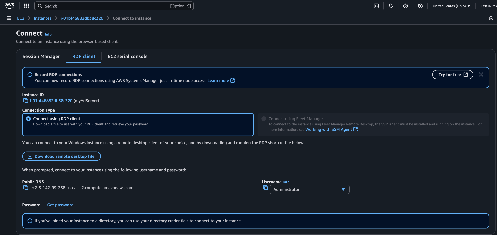
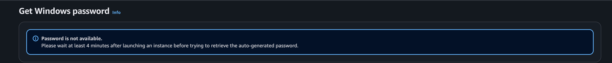
- After AWS allows you to hit **get password**, you are going to **upload your Private Key File**, select **Decrypt Password**, and then copy the password to clipboard, we're going to need it in a second
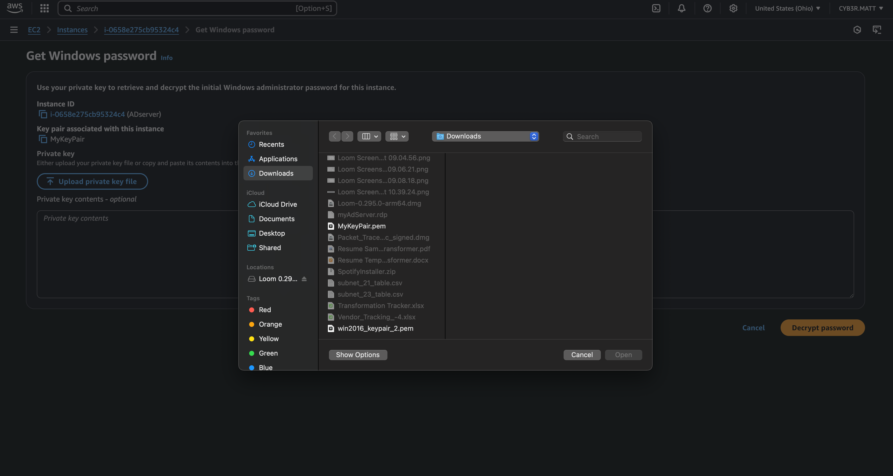
- Remeber when we downloaded the **RDP** file? Go ahead and open it, and you should be prompted to enter the password for the RDP Client, and welcome to your first AD Server!
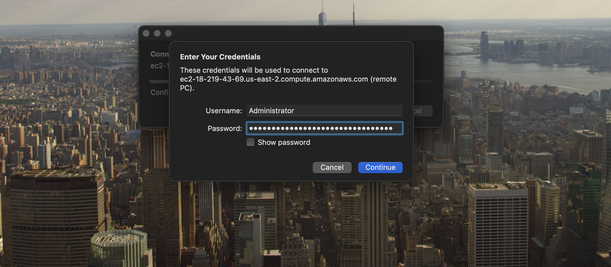

